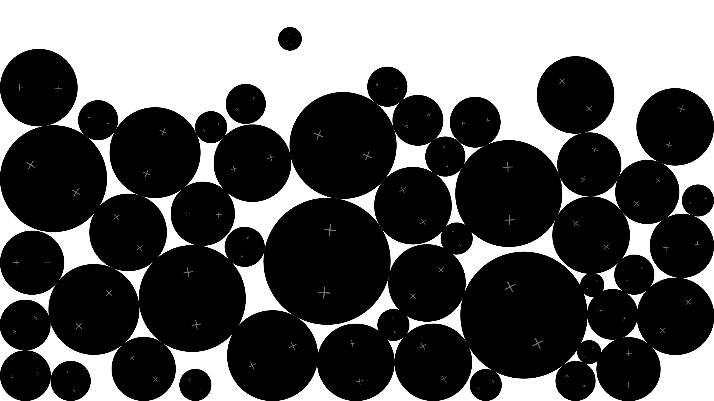

# Jampack

A tribute to [Yugo Nakamura (yugop)](http://www.yugop.com/)'s **Jampack** -- an interactive 2D physics toy where circles continuously fall, collide, stack, and cycle in a mesmerizing loop.



## Original

This project is a recreation of yugop's Jampack, a classic interactive piece that showcases minimalist physics-based generative art. The original featured black circles with subtle cross markers falling and packing together with satisfying physical behavior.

## Interaction

- **Watch** -- circles auto-drop and pack together with gravity
- **Click** empty space to drop a new circle
- **Drag & drop** any circle to toss it around -- other circles react physically
- When the circle count exceeds the limit, the oldest circle **shrinks inward** and disappears

## Technical Details

**Pure Canvas 2D** -- no physics engine, no dependencies, no build step.

- Custom 2D rigid body physics with circle-circle collision resolution (impulse-based)
- Fixed timestep simulation (1/60s) with 8 substeps per frame for stable stacking
- Mass-proportional collision response with restitution and friction
- Angular velocity derived from surface contact friction and tangential collision impulse
- Two small symmetric cross marks per circle serve as rotation indicators
- Exponential ease-out for grow-in and shrink-out animations
- Dynamic `MAX_CIRCLES` calculated from viewport area to maintain ~2/3 fill density
- Dual loop architecture: `setInterval` for physics (survives background tab throttling) + `requestAnimationFrame` for smooth rendering
- Drag interaction with velocity transfer on release -- flings circles with momentum
- HiDPI / Retina canvas scaling via `devicePixelRatio`
- Responsive -- adapts circle count and sizes to any window dimension

## Files

```
index.html   -- entry point
app.js       -- all physics, rendering, and interaction logic (~370 lines)
```

## Run Locally

Just open `index.html` in a browser, or serve it:

```bash
npx serve .
# or
python3 -m http.server
```

## Credits

- Original concept: [Yugo Nakamura (yugop)](http://www.yugop.com/)
- Recreation: HU, CHIN-HSIANG
